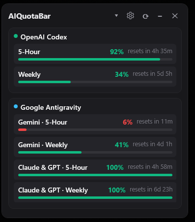

# AIQuotaBar

**AIQuotaBar** is a lightweight, local-first Windows 11 desktop utility designed to keep AI coding-agent subscription quotas and rate limits visible at a glance. Built natively with .NET 10 and WPF, AIQuotaBar provides a customizable, low-overhead widget that operates entirely on your local machine without telemetry, tracking, or cloud infrastructure.

<!-- Application Preview Screenshot Placeholder -->
<!-- When available, the owner will add app-preview.png to docs/images/ -->
<!--  -->

---

## Key Features

* **Multi-Provider Monitoring:** Track quotas across multiple AI tools simultaneously in a single, unified widget.
* **Local-First & Private:** Direct local inter-process communication (IPC) with official installed tools. No telemetry, no analytics, and no remote server backend.
* **Provider-Owned Authentication:** Never asks for or stores API keys, tokens, or passwords. Authentication remains 100% managed by each provider's official CLI or application.
* **Compact & Expanded Modes:** Switch between a rich multi-window breakdown and a minimal, unobtrusive single-line status bar.
* **Always-on-Top & Docking:** Keep quotas pinned above active code editors or let the widget stay tucked in the system tray.
* **Semantic Health Bars:** Color-coded progress indicators give an immediate visual summary of remaining capacity and reset times.
* **Zero Runtime Dependencies:** Packaged as a self-contained, single-file Windows x64 executable requiring no separate .NET installation.

---

## Supported Providers

| Provider | Status | Integration Mechanism |
| :--- | :--- | :--- |
| **OpenAI Codex** | Supported | Official local Codex app-server via local stdio JSON-RPC |
| **Google Antigravity** | Supported | Official `agy` CLI via `agy -p "/usage" --output-format json` |

### Future & Requested Providers
Support for additional AI developer tools (e.g., Claude Code, Cursor, GitHub Copilot) may be evaluated in future releases based on community demand and the availability of official local quota interfaces.

---

## Requirements

### AIQuotaBar
* **Operating System:** Windows 11 x64 (or Windows 10 x64 21H2+).
* **Runtime:** None required for the portable release (the executable is self-contained).

### Provider Requirements
* **OpenAI Codex:** Requires an installed, authenticated Codex environment. AIQuotaBar connects exclusively via local stdio to the official Codex app-server. AIQuotaBar **never** inspects or parses `.codex/auth.json` or credential stores directly.
* **Google Antigravity:** Requires the official Antigravity CLI (`agy`) to be installed in your `PATH` and authenticated. Quota information is retrieved using `agy -p "/usage" --output-format json`. AIQuotaBar does not install or configure Antigravity on your behalf.

---

## Installation

AIQuotaBar is distributed as a lightweight, portable single-file executable:

1. Download the latest `AIQuotaBar-<version>-win-x64.zip` package from GitHub Releases.
2. Extract the ZIP archive to a folder of your choice.
3. Run `AIQuotaBar.exe`.

> [!NOTE]
> AIQuotaBar requires no installer or administrator privileges. Settings and window positioning are automatically saved to `%LOCALAPPDATA%\AIQuotaBar\settings.json`.

---

## Usage & Controls

* **Mode Toggle (⤢ / ⤡):** Toggle between Expanded mode (showing all quota details and reset timestamps) and Compact mode (a minimal single-line status bar).
* **Always on Top (📌):** Pin the widget above your IDE or editor windows.
* **Manual Refresh (↻):** Refresh quotas immediately on demand.
* **System Tray:** Minimize AIQuotaBar to the Windows taskbar notification area (`NotifyIcon`). Right-click the tray icon to access the menu or restore the window.
* **Start with Windows:** Enable automatic launch on login via the settings menu (`HKCU\Software\Microsoft\Windows\CurrentVersion\Run`).

---

## Understanding Quota Progress & Colours

Progress bars in AIQuotaBar represent **Quota Remaining**:

* 🟢 **Teal / Green:** Healthy remaining capacity (> 20%).
* 🟡 **Amber:** Warning threshold; quota is getting low (<= 20%).
* 🔴 **Red:** Critical / exhausted quota (<= 5%).

Reset timers indicate when the corresponding quota window (e.g., 5-hour rolling window or weekly allocation) will refresh.

---

## Privacy & Security Model

AIQuotaBar is engineered around strict privacy boundaries:

* **No Telemetry or Analytics:** AIQuotaBar has no backend, telemetry, or analytics service of its own. It makes zero outbound network requests on its own behalf.
* **Local Process Communication:** Provider usage is retrieved exclusively through the provider's locally installed official client or app-server (which may itself communicate with that provider's cloud services).
* **Zero Credential Access:** AIQuotaBar never reads auth files, session tokens, or API keys. Credentials stay with the official provider tools.
* **Process Isolation:** All background provider processes are bounded by strict timeouts and automatically terminated when AIQuotaBar exits.

---

## Building from Source

### Prerequisites
* [.NET 10.0 SDK](https://dotnet.microsoft.com/download)
* Git

### Build Instructions

1. **Clone the repository:**
   ```powershell
   git clone https://github.com/MDoots/AIQuotaBar.git
   cd AIQuotaBar
   ```

2. **Compile the solution:**
   ```powershell
   dotnet build AIQuotaBar.slnx -c Release
   ```

3. **Run the test suite:**
   ```powershell
   dotnet test AIQuotaBar.slnx -c Release
   ```

4. **Produce a self-contained portable release:**
   ```powershell
   .\scripts\build-portable.ps1 -Configuration Release -Runtime win-x64
   ```
   The self-contained binary will be generated at `artifacts/portable/win-x64/AIQuotaBar.exe`.

---

## Contributing

Contributions are welcome! Please read our [Contributing Guide](CONTRIBUTING.md) for architectural guardrails, layer boundaries, and pull request guidelines.

---

## Security

To report security vulnerabilities or review our security practices, please see our [Security Policy](SECURITY.md).

---

## License

This project is licensed under the [MIT License](LICENSE).
