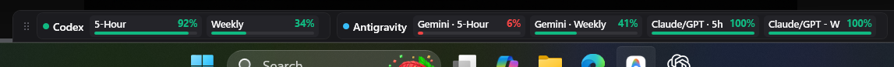

# AIQuotaBar

**AIQuotaBar** is a lightweight, local-first Windows 11 desktop utility designed to keep AI coding-agent subscription quotas and rate limits visible at a glance. Built natively with .NET 10 and WPF, AIQuotaBar provides a customizable, low-overhead widget that operates entirely on your local machine without telemetry, tracking, or cloud infrastructure.

**Floating mode**


**Docked mode**



---

## Key Features

* **Five-Provider Monitoring:** Track quotas across OpenAI Codex, Google Antigravity, Claude Code, Grok Build, and GitHub Copilot in a single, unified widget.
* **Local-First & Private:** Direct local inter-process communication (IPC) with official installed tools. No telemetry, no analytics, and no remote server backend.
* **Provider-Owned Authentication:** Never asks for or stores API keys, tokens, or passwords. Authentication remains 100% managed by each provider's official CLI or application.
* **Plan-Agnostic Quota Display:** Displays finite quotas whether using Free, trial, promotional, or paid subscription tiers where exposed by the provider.
* **Adaptive & Resizable Floating Widget:** Responsive width adjustment with both Expanded and Compact layout modes.
* **Soft Docked Mode:** Dock the bar smoothly to the Top or Bottom of your screen with optional auto-hide and horizontal alignment controls.
* **Provider & Quota-Row Visibility:** Customize which providers and individual quota windows appear in the widget.
* **Quota-Aware Tray Health:** System tray icon reflects overall quota health and lowest remaining capacity at a glance.
* **Low Quota Notifications:** Desktop alerts when quotas drop below warning or exhaustion thresholds, with automatic baseline re-arming.
* **Windows Sleep/Resume Recovery:** Automatically coordinates recovery refreshes when waking your PC from sleep.
* **Last-Known-Good Resilience:** Preserves valid quota data during transient refresh timeouts or communication glitches with subtle status indicators.
* **Zero Runtime Dependencies:** Packaged as a self-contained, single-file Windows x64 executable requiring no separate .NET installation.

---

## Supported Providers

AIQuotaBar communicates directly with official locally installed developer tools:

| Provider | Status | Integration Mechanism |
| :--- | :--- | :--- |
| **OpenAI Codex** | Supported | Official local Codex app-server via local stdio JSON-RPC (`codex app-server --stdio`). |
| **Google Antigravity** | Supported | Official `agy` CLI using structured usage output (`agy -p "/usage" --output-format json`). |
| **Claude Code** | Supported | Official native Claude Code CLI (`claude auth status --json` and local `/usage` surface). |
| **Grok Build** | Supported | Official local Grok Build ACP stdio server (`grok --no-auto-update agent stdio`) via provider-owned `x.ai/billing` (with fallback). |
| **GitHub Copilot** | Supported | Official `GitHub.Copilot.SDK` connected to local `copilot.exe` using account quota RPC (`account.getQuota`). No model session created. |

---

## Plan & Tier Compatibility

AIQuotaBar is **plan-agnostic**. It does not require a paid tier itself. Where a provider exposes finite quota for a Free, trial, promotional, or paid account, that quota can be displayed.

*(Note: Not all providers provide finite quota allowances for every account tier or billing model).*

---

## Requirements

### AIQuotaBar
* **Operating System:** Windows 11 x64.
* **Runtime:** None required for the portable release (the executable is self-contained).

### Provider Requirements
* **OpenAI Codex:** Requires the official Codex CLI installed and authenticated. AIQuotaBar launches a short-lived local child process connecting over stdio.
* **Google Antigravity:** Requires the official Antigravity CLI (`agy`) installed and authenticated (standalone Antigravity desktop app is not supported).
* **Claude Code:** Requires the official Claude Code CLI installed and authenticated with an active Claude Code entitlement (Claude Desktop alone is not supported).
* **Grok Build:** Requires the official Grok CLI (`grok`) installed and authenticated (browser-only Grok accounts are not supported).
* **GitHub Copilot:** Requires GitHub Copilot CLI (`copilot.exe`) installed and authenticated with an active Copilot entitlement (VS Code extension alone is not supported).

> [!NOTE]
> **Independent Local Execution:** The normal provider application, editor window, or terminal session does **not** need to stay open. AIQuotaBar launches isolated, short-lived query processes against installed CLIs.
>
> On a clean machine without developer tools installed, AIQuotaBar displays a clean onboarding view (**"No supported providers detected"**) with quick access to Settings where you can view setup guidance for all five supported providers.

---

## Installation & Distribution

### Portable Release (GitHub)
1. Download the latest `AIQuotaBar-<version>-win-x64.zip` package from [GitHub Releases](https://github.com/MDoots/AIQuotaBar/releases).
2. Extract the ZIP archive to a folder of your choice.
3. Run `AIQuotaBar.exe`.

> [!NOTE]
> AIQuotaBar requires no installer or administrator privileges. Settings and preferences are automatically saved to `%LOCALAPPDATA%\AIQuotaBar\settings.json`.

### Microsoft Store
AIQuotaBar is packaged for the Microsoft Store. The v1.0 release is pending certification.

---

## Usage & Controls

* **Mode Toggle (▴ / ▾):** Switch between Expanded multi-row and Compact single-line layouts.
* **Dock Mode (Floating / Top / Bottom):** Switch between floating window and screen-edge docked modes.
* **Always on Top (📌):** Pin the floating widget above your IDE or editor windows.
* **Manual Refresh (↻):** Refresh quotas immediately on demand.
* **System Tray:** Minimize AIQuotaBar to the Windows notification area (`NotifyIcon`). Right-click the tray icon and select **"Open AIQuotaBar"** (or left-click / double-click) to restore the window.
* **Start with Windows:** Enable automatic launch on login via the settings menu.

---

## Understanding Quota Progress & Colours

Progress bars in AIQuotaBar represent **Quota Remaining**:

* 🟢 **Teal / Green:** Healthy remaining capacity (> 30%).
* 🟡 **Amber:** Warning threshold; quota is getting low (10–30%).
* 🔴 **Red:** Critical / exhausted quota (< 10%).

Reset countdowns indicate when the corresponding quota window (e.g., rolling rate limit or weekly allocation) will reset.

---

## Privacy & Security Model

AIQuotaBar is engineered around strict privacy boundaries:

* **No Telemetry or Analytics:** AIQuotaBar has no backend, telemetry, tracking, or analytics services of its own. It makes zero outbound network requests on its own behalf.
* **Local Process Communication:** Quota is retrieved exclusively through local IPC with provider-owned CLI tools (which may themselves contact their respective provider cloud services).
* **Zero Credential Access:** AIQuotaBar never reads auth files, session tokens, or API keys directly. Credentials remain provider-owned.
* **Process Isolation:** All background query processes are bounded by strict timeouts, execute zero model inferences, and terminate automatically on exit or cancellation.

For full details, please review our comprehensive [Privacy Policy](PRIVACY.md).

---

## Building from Source

### Prerequisites
* [.NET 10.0 SDK](https://dotnet.microsoft.com/download)
* Git

### Build Instructions

1. **Clone the repository:**
   ```powershell
   git clone https://github.com/MDoots/AIQuotaBar.git
   cd AIQuotaBar
   ```

2. **Compile the solution:**
   ```powershell
   dotnet build AIQuotaBar.slnf -c Release
   ```

3. **Run the test suite:**
   ```powershell
   dotnet test AIQuotaBar.slnf -c Release
   ```

4. **Produce a self-contained portable release:**
   ```powershell
   powershell -ExecutionPolicy Bypass -File .\scripts\build-portable.ps1
   ```
   The self-contained binary will be generated at `artifacts/portable/win-x64/AIQuotaBar.exe`.

---

## Contributing

Contributions are welcome! Please read our [Contributing Guide](CONTRIBUTING.md) for architectural guardrails, layer boundaries, and pull request guidelines.

---

## Support

I used my quota to make this, so you don’t have to. 😄

If AIQuotaBar saves you some time, quota or frustration, feel free to [buy me a coffee](https://buymeacoffee.com/mdoots). ☕

---

## Security

To report security vulnerabilities or review our security practices, please see our [Security Policy](SECURITY.md).

---

## License

This project is licensed under the [MIT License](LICENSE).
