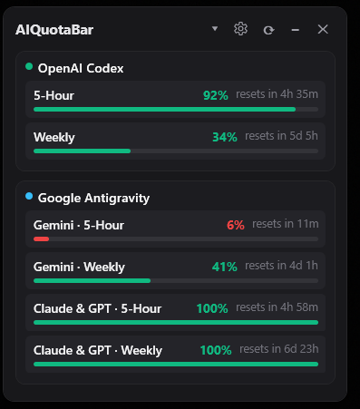
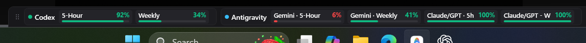

# AIQuotaBar

**AIQuotaBar** is a lightweight, local-first Windows 11 desktop utility designed to keep AI coding-agent subscription quotas and rate limits visible at a glance. Built natively with .NET 10 and WPF, AIQuotaBar provides a customizable, low-overhead widget that operates entirely on your local machine without telemetry, tracking, or cloud infrastructure.

**Floating mode**



**Docked mode**



---

## Key Features

* **Five Provider Integrations:** Monitor available quota and setup status for OpenAI Codex, Google Antigravity, Claude Code, Grok Build, and GitHub Copilot. Claude Code currently provides authentication status only.
* **Local-First & Private:** Direct local inter-process communication (IPC) with official installed tools. No telemetry, no analytics, and no remote server backend.
* **Provider-Owned Authentication:** Never asks for or stores API keys, tokens, or passwords. Authentication remains 100% managed by each provider's official CLI or application.
* **Plan-Agnostic Quota Display:** Displays finite quotas where a provider exposes them; account tier and provider capability determine what can be shown.
* **Adaptive & Resizable Floating Widget:** Responsive width adjustment with both Expanded and Compact layout modes.
* **Soft Docked Mode:** Dock the bar smoothly to the Top or Bottom of your screen with optional auto-hide and horizontal alignment controls.
* **Provider & Quota-Row Visibility:** Customize which providers and individual quota windows appear in the widget.
* **Quota-Aware Tray Health:** System tray icon reflects overall quota health and lowest remaining capacity at a glance.
* **Low Quota Notifications:** Desktop alerts when quotas drop below warning or exhaustion thresholds, with automatic baseline re-arming.
* **Windows Sleep/Resume Recovery:** Automatically coordinates recovery refreshes when waking your PC from sleep.
* **Last-Known-Good Resilience:** Preserves valid quota data during transient refresh timeouts or communication glitches with subtle status indicators.
* **Clear Rescan Feedback:** Settings shows provider-scan progress and a persistent completion result, including when nothing changed.
* **DPI-Aware Windows UI:** Declares per-monitor DPI awareness for Windows scaling support.
* **Zero Runtime Dependencies:** Packaged as a self-contained, single-file Windows x64 executable requiring no separate .NET installation.

---

## Supported Providers

AIQuotaBar communicates directly with official locally installed developer tools:

| Provider | Status | Integration Mechanism |
| :--- | :--- | :--- |
| **OpenAI Codex** | Supported with verified helper configuration | Official `codex --disable plugins app-server` stdio interface via `account/rateLimits/read`. The helper verifies its process-local plugins setting before querying quota. Normal Codex plugin settings remain unchanged. |
| **Google Antigravity** | Supported | Official `agy` CLI using structured usage output (`agy -p "/usage" --output-format json`). |
| **Claude Code** | Authentication status supported; quota currently unavailable | Official Claude Code CLI authentication status (`claude auth status --json`). Open Claude Code's own usage view for quota details; AIQuotaBar does not capture an interactive usage session. |
| **Grok Build** | Supported | Official local Grok Build ACP stdio server (`grok --no-auto-update agent stdio`) via provider-owned `x.ai/billing` (with fallback). |
| **GitHub Copilot** | Supported | Official `GitHub.Copilot.SDK` connected to local `copilot.exe` using account quota RPC (`account.getQuota`). No model session created. |

---

## Plan & Tier Compatibility

AIQuotaBar is **plan-agnostic**. It does not require a paid tier itself. Where a provider exposes finite quota for a Free, trial, promotional, or paid account, that quota can be displayed.

*(Note: Not all providers provide finite quota allowances for every account tier or billing model).*

---

## Requirements

### AIQuotaBar
* **Operating System:** Windows 11 x64.
* **Runtime:** None required for the portable release (the executable is self-contained).

### Provider Requirements
* **OpenAI Codex:** Requires an official installed native CLI with provider-owned authentication and an app-server that verifies `config.features.plugins=false` for the quota helper. Live validation used codex-cli 0.159.2. If that safeguard cannot be verified, AIQuotaBar pauses that selected executable for the current app session and marks retained quota as stale. Other versions are not covered by this live validation; see the [corrective investigation](docs/codex-staging-corrective-investigation.md).
* **Google Antigravity:** Requires the official Antigravity CLI (`agy`) installed and authenticated (standalone Antigravity desktop app is not supported).
* **Claude Code:** Requires the official Claude Code CLI installed and authenticated with an active Claude Code entitlement (Claude Desktop alone is not supported). AIQuotaBar reports official authentication status; quota details remain in Claude Code's own usage view until a supported non-interactive quota interface is available.
* **Grok Build:** Requires the official Grok CLI (`grok`) installed and authenticated (browser-only Grok accounts are not supported). Quota windows appear only when the official local interface exposes finite values.
* **GitHub Copilot:** Requires GitHub Copilot CLI (`copilot.exe`) installed and authenticated with an active Copilot entitlement (VS Code extension alone is not supported).

> [!NOTE]
> **Independent Local Execution:** The normal provider application, editor window, or terminal session does **not** need to stay open. AIQuotaBar launches isolated, short-lived query processes against installed CLIs.
>
> On a clean machine without developer tools installed, AIQuotaBar displays a clean onboarding view (**"No supported providers detected"**) with quick access to Settings where you can view setup guidance for all five supported providers.
>
> Provider CLIs own their authentication and may contact their respective services. AIQuotaBar's own process is local-only; it does not guarantee that every provider, account tier, or billing model exposes a finite quota.

---

## Installation & Distribution

### Portable Release (GitHub)
1. Download the latest `AIQuotaBar-<version>-win-x64.zip` package from [GitHub Releases](https://github.com/MDoots/AIQuotaBar/releases).
2. Extract the ZIP archive to a folder of your choice.
3. Run `AIQuotaBar.exe`.

> [!NOTE]
> AIQuotaBar requires no installer or administrator privileges. Settings and preferences are automatically saved to `%LOCALAPPDATA%\AIQuotaBar\settings.json`.

### Microsoft Store
AIQuotaBar is [available in the Microsoft Store](https://apps.microsoft.com/detail/9NTTSH588BQ9). The 1.0.5 update restores live Codex quota polling with a helper configuration check. See the [release record](docs/release-acceptance-1.0.5.md) for publication and submission status, completed checks and remaining limitations.

---

## Usage & Controls

* **Mode Toggle (▴ / ▾):** Switch between Expanded multi-row and Compact single-line layouts.
* **Dock Mode (Floating / Top / Bottom):** Switch between floating window and screen-edge docked modes.
* **Always on Top (📌):** Pin the floating widget above your IDE or editor windows.
* **Manual Refresh (↻):** Refresh quotas immediately on demand.
* **System Tray:** Minimize AIQuotaBar to the Windows notification area (`NotifyIcon`). Right-click the tray icon and select **"Open AIQuotaBar"** (or left-click / double-click) to restore the window.
* **Start with Windows:** Enable automatic launch on login via the settings menu.

---

## Understanding Quota Progress & Colours

Progress bars in AIQuotaBar represent **Quota Remaining**:

* 🟢 **Teal / Green:** Healthy remaining capacity (> 30%).
* 🟡 **Amber:** Warning threshold; quota is getting low (10–30%).
* 🔴 **Red:** Critical / exhausted quota (< 10%).

Reset countdowns indicate when the corresponding quota window (e.g., rolling rate limit or weekly allocation) will reset.

---

## Privacy & Security Model

AIQuotaBar is engineered around strict privacy boundaries:

* **No Telemetry or Analytics:** AIQuotaBar has no backend, telemetry, tracking, or analytics services of its own. It makes zero outbound network requests on its own behalf.
* **Local Process Communication:** Quota is retrieved exclusively through local IPC with provider-owned CLI tools (which may themselves contact their respective provider cloud services).
* **Zero Credential Access:** AIQuotaBar never reads auth files, session tokens, or API keys directly. Credentials remain provider-owned.
* **Process Isolation:** All background query processes are bounded by strict timeouts, execute zero model inferences, and terminate automatically on exit or cancellation.

For full details, please review our comprehensive [Privacy Policy](PRIVACY.md).

---

## Building from Source

### Prerequisites
* [.NET 10.0 SDK](https://dotnet.microsoft.com/download)
* Git

### Build Instructions

1. **Clone the repository:**
   ```powershell
   git clone https://github.com/MDoots/AIQuotaBar.git
   cd AIQuotaBar
   ```

2. **Compile the solution:**
   ```powershell
   dotnet build AIQuotaBar.slnf -c Release
   ```

3. **Run the test suite:**
   ```powershell
   dotnet test AIQuotaBar.slnf -c Release
   ```

4. **Produce a self-contained portable release:**
   ```powershell
   powershell -ExecutionPolicy Bypass -File .\scripts\build-portable.ps1
   ```
   The self-contained binary will be generated at `artifacts/portable/win-x64/AIQuotaBar.exe`. Record the hash of the exact frozen artifact before distribution.

---

## Contributing

Contributions are welcome! Please read our [Contributing Guide](CONTRIBUTING.md) for architectural guardrails, layer boundaries, and pull request guidelines.

### Agent onboarding

All agents, including those that do not automatically discover `AGENTS.md`, must
read [AGENTS.md](AGENTS.md), [project context](docs/agent/PROJECT.md),
[current status](docs/agent/STATUS.md) and [roadmap](docs/agent/ROADMAP.md) before
significant work. Use the [architecture and development setup](docs/agent/ARCHITECTURE.md),
[decision log](docs/agent/DECISIONS.md) and [latest handover](docs/agent/HANDOVER.md)
as needed, and follow the [existing routing policy](docs/agent/MODEL_ROUTING.md).

Work in bounded tasks, preserve the architecture and other contributors' edits,
run the required checks, and update state/decisions/handover when relevant. Never
commit secrets or private user data; obtain authorization before publishing,
deploying or merging. The merged GitHub `main` branch is canonical; unmerged
branch documentation is provisional. Windows is required for the full WPF build
and test suite; isolated Linux agents have a smaller documented test scope.

---

## Support

I used my quota to make this, so you don’t have to. 😄

If AIQuotaBar saves you some time, quota or frustration, feel free to [buy me a coffee](https://buymeacoffee.com/mdoots). ☕

---

## Security

To report security vulnerabilities or review our security practices, please see our [Security Policy](SECURITY.md).

---

## License

This project is licensed under the [MIT License](LICENSE).
